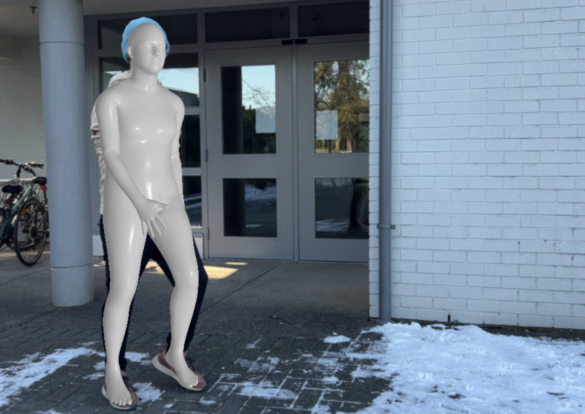
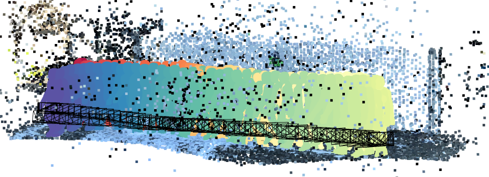

## Preprocess a video for training using Docker

Our preprocessing pipeline uses [COLMAP](https://colmap.github.io), [Detectron2](https://github.com/facebookresearch/detectron2), [mmpose](https://github.com/open-mmlab/mmpose), [ROMP](https://github.com/Arthur151/ROMP), and [BoostingMonocularDepth](https://github.com/compphoto/BoostingMonocularDepth) to estimate the 2D or 3D geometry of the scene or the human.

- Build docker image:

   1.  ```sh
       docker build -t neuman .
       ```

- Start the docker container:

   To virtualize the GPUs, we need to install [nvidia-docker](https://github.com/NVIDIA/nvidia-docker).

   ```sh
   docker run --runtime=nvidia -e NVIDIA_VISIBLE_DEVICES=all -ti -v /path/to/data_folder:/data -v /path/to/smplx:/neuman/data/smplx --entrypoint bash neuman
   ```

   Notice that we mount two folders to the Docker container: `/path/to/data_folder` is the path to the video folder on the host system, and `/path/to/smplx` is the path to `smplx` folder on the host system(for more details, see Demo section [here](../README.md))

- Preprocess inside the container:

   1. Generate the shell script: 
      ```sh
      cd /neuman/preprocess;
      python gen_run.py --video /data/my_video.mov
      ```

   2. Run the whole preprocess pipeline: 
       ```sh
       bash -i ./run.sh
       ```

   3. The final output will be save at `my_video/output`.

- Visual check:

   1. Check SMPL estimates, at `overlay/optimized` folder, please make sure the human subject has a corresponding SMPL estimates.
   *Example overlay*:
   <p align="center">
      
   </p>

   2. Check scene and SMPL mesh alignment, run: `python draw_scene.py --scene_dir path/to/output` to visualize both, please make sure the camera trajectory looks reasonable, and the feet of SMPL meshes are touching the ground plane.
   *Example scene and SMPL mesh alignment*:
    <p align="center">
      
   </p>
